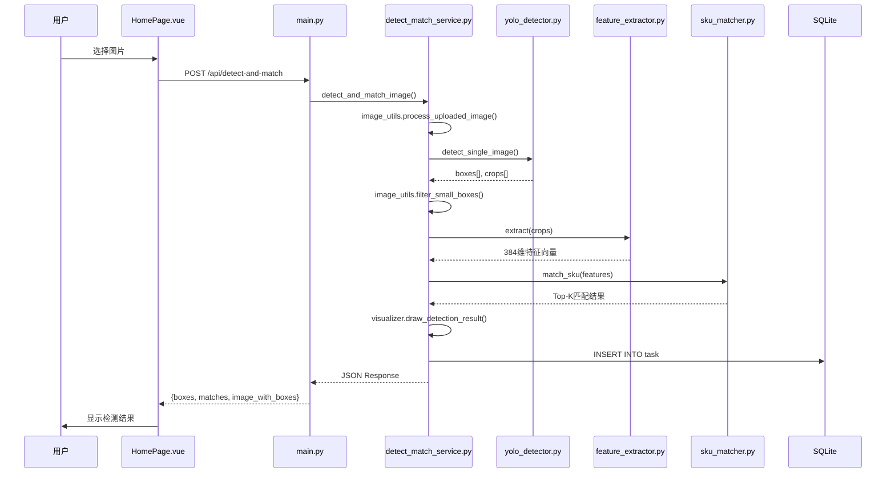
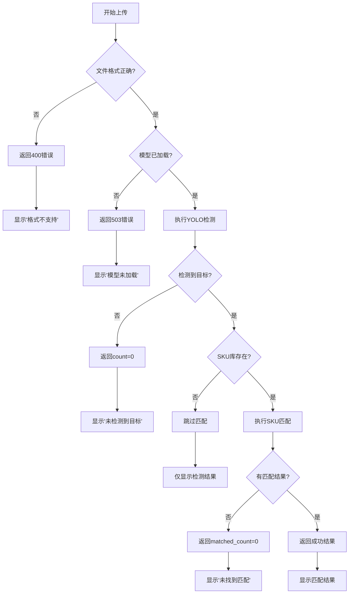
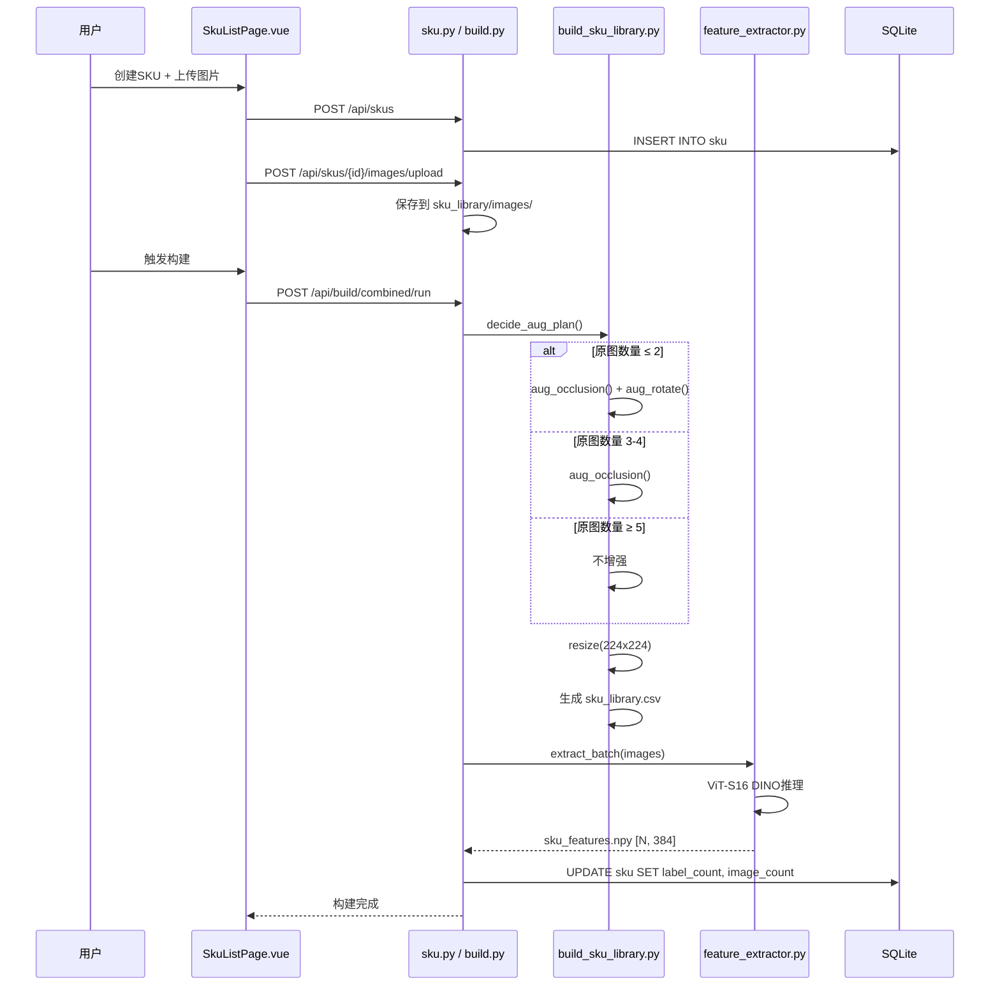

# Pack 地堆检测系统设计文档 V2

## 第一部分：系统架构

### 1.1 技术栈全景图

```
┌─────────────────────────────────────────────────────────────────────────────┐
│                              用户界面层 (Frontend)                           │
│  ┌─────────────────────────────────────────────────────────────────────┐   │
│  │  Vue 3 + Vite + Pinia + Element Plus                                │   │
│  │  文件: web/frontend/src/                                            │   │
│  │  - pages/: HomePage, TaskListPage, SkuListPage, SkuReviewPage       │   │
│  │  - components/task/: TaskDetailPanel, TaskStats, DetectionList...   │   │
│  └─────────────────────────────────────────────────────────────────────┘   │
└─────────────────────────────────────────────────────────────────────────────┘
                                      │
                                      │ HTTP REST API (JSON / multipart-form)
                                      ▼
┌─────────────────────────────────────────────────────────────────────────────┐
│                              后端服务层 (Backend)                            │
│  ┌─────────────────────────────────────────────────────────────────────┐   │
│  │  Python 3.10 + FastAPI + SQLAlchemy                                 │   │
│  │  文件: web/backend/                                                  │   │
│  │  - main.py: FastAPI入口, 路由配置                                    │   │
│  │  - api/: task.py, sku.py, sku_review.py, build.py, logs.py          │   │
│  │  - services/: DetectMatchService, DetectionService, MatchService    │   │
│  │  - repositories/: TaskRepository                                     │   │
│  └─────────────────────────────────────────────────────────────────────┘   │
└─────────────────────────────────────────────────────────────────────────────┘
                                      │
                                      │ Python 函数调用
                                      ▼
┌─────────────────────────────────────────────────────────────────────────────┐
│                            核心算法层 (Core)                                 │
│  ┌───────────────────────────┐    ┌───────────────────────────────────┐    │
│  │  YOLO 目标检测            │    │  DINO + OML 特征匹配              │    │
│  │  文件: core/detector/     │    │  文件: core/matcher/              │    │
│  │  - yolo_detector.py       │    │  - feature_extractor.py           │    │
│  │  - 模型: best.pt          │    │  - sku_matcher.py                 │    │
│  │  - 框架: Ultralytics      │    │  - 模型: ViT-S16 DINO (384维)     │    │
│  └───────────────────────────┘    └───────────────────────────────────┘    │
└─────────────────────────────────────────────────────────────────────────────┘
                                      │
                                      │ 文件 I/O / 数据库操作
                                      ▼
┌─────────────────────────────────────────────────────────────────────────────┐
│                             数据存储层 (Data)                                │
│  ┌─────────────────────┐  ┌─────────────────┐  ┌───────────────────────┐   │
│  │  SQLite 数据库      │  │  SKU特征库      │  │  文件存储             │   │
│  │  data/pack.db       │  │  sku_features.npy│  │  data/uploads/       │   │
│  │  - Task 表          │  │  sku_library.csv │  │  data/tasks/         │   │
│  │  - SKU 表           │  │  images/         │  │  training/sku/crops/ │   │
│  └─────────────────────┘  └─────────────────┘  └───────────────────────┘   │
└─────────────────────────────────────────────────────────────────────────────┘
```

### 1.2 设计决策说明

| 决策点                    | 选择         | 理由                                                                                                               |
| ------------------------- | ------------ | ------------------------------------------------------------------------------------------------------------------ |
| **HTTP轮询 vs WebSocket** | HTTP轮询     | 1. 实现简单，无需维护长连接<br>2. 任务状态变更频率低（秒级），轮询开销可接受<br>3. 避免WebSocket的浏览器兼容性问题 |
| **Pinia vs Vuex**         | Pinia        | 1. Vue 3 官方推荐，TypeScript支持更好<br>2. 去除mutations，代码更简洁<br>3. 模块化设计，按需加载                   |
| **SQLite vs PostgreSQL**  | SQLite       | 1. 单机部署，无需独立数据库服务<br>2. 数据量小（任务记录、SKU信息），SQLite足够<br>3. 零配置，便于部署             |
| **FastAPI vs Flask**      | FastAPI      | 1. 原生异步支持，适合IO密集型任务<br>2. 自动生成OpenAPI文档<br>3. Pydantic数据验证，类型安全                       |
| **ViT-S16 vs ResNet**     | ViT-S16 DINO | 1. DINO自监督学习，无需大量标注<br>2. 384维特征，计算效率高<br>3. OML库提供预训练模型，开箱即用                    |

### 1.3 目录结构说明

```
pack/
├── config.py                    # 全局配置（路径、阈值、模型参数）
├── requirements.txt             # Python依赖
├── start-all.bat               # 启动脚本
│
├── core/                        # 【核心算法层】
│   ├── detector/
│   │   └── yolo_detector.py    # YOLO检测器封装
│   ├── matcher/
│   │   ├── feature_extractor.py # ViT-S16 DINO特征提取
│   │   └── sku_matcher.py      # SKU特征匹配器
│   ├── utils/
│   │   ├── image_utils.py      # 图像处理工具
│   │   ├── logger.py           # 日志工具
│   │   └── pytorch_utils.py    # PyTorch环境配置
│   └── visualizer.py           # 检测结果可视化
│
├── web/                         # 【Web应用层】
│   ├── backend/                 # 后端 (Python + FastAPI)
│   │   ├── main.py             # FastAPI入口
│   │   ├── database.py         # 数据库配置
│   │   ├── api/                # API路由层
│   │   │   ├── task.py         # 任务管理API
│   │   │   ├── sku.py          # SKU管理API
│   │   │   ├── sku_review.py   # SKU审核API
│   │   │   ├── build.py        # 构建API
│   │   │   └── logs.py         # 日志API
│   │   ├── services/           # 业务服务层
│   │   │   ├── detect_match_service.py  # 检测+匹配复合服务
│   │   │   ├── detection_service.py     # 检测服务
│   │   │   └── match_service.py         # 匹配服务
│   │   ├── repositories/       # 数据访问层
│   │   │   └── task_repository.py
│   │   ├── models/             # 数据模型
│   │   │   ├── task.py, sku.py, detection_box.py, match_result.py
│   │   └── schemas/            # Pydantic模型
│   │       └── schemas.py
│   │
│   └── frontend/                # 前端 (Vue 3)
│       └── src/
│           ├── api/client.js   # API客户端封装
│           ├── stores/app.js   # Pinia状态管理
│           ├── components/
│           │   ├── pages/      # 页面组件
│           │   ├── task/       # 任务相关组件
│           │   ├── sku/        # SKU相关组件
│           │   ├── ui/         # UI组件
│           │   ├── upload/     # 上传组件
│           │   └── layout/     # 布局组件
│           └── utils/          # 工具函数
│
├── training/                    # 【模型训练层】
│   ├── yolo/                    # YOLO训练
│   │   ├── train.py            # 训练脚本
│   │   ├── predict.py          # 预测脚本
│   │   ├── loss_with_boundary_fast.py  # 边界感知损失
│   │   ├── configs/            # 训练配置
│   │   └── runs/               # 训练输出
│   │       └── .../weights/best.pt  # 模型权重
│   │
│   └── sku/                     # SKU特征训练
│       ├── build_sku_library.py # SKU库构建（增强+入库）
│       ├── extract_features.py  # 特征提取
│       ├── train_oml.py        # OML度量学习微调
│       ├── evaluate.py         # 评估脚本
│       └── crops/              # SKU裁剪图片库
│
├── scripts/                     # 【工具脚本层】
│   ├── data/                    # 数据处理
│   ├── detect/                  # 批量检测
│   └── visualize/               # 可视化工具
│
└── data/                        # 【数据存储层】（运行时生成）
    ├── pack.db                  # SQLite数据库
    ├── models/yolo/best.pt      # YOLO模型
    ├── models/sku/vits16_dino_finetuned.pth  # 微调后的SKU模型
    ├── sku_library/             # SKU特征库
    │   ├── sku_features.npy
    │   ├── sku_library.csv
    │   └── images/
    ├── tasks/                   # 任务数据
    └── uploads/                 # 上传文件
```

### 1.4 通信协议

| 协议类型          | 说明                                                           |
| ----------------- | -------------------------------------------------------------- |
| **HTTP REST API** | 前后端通信，所有接口以 `/api/` 开头                            |
| **请求格式**      | 文件上传: `multipart/form-data`<br>其他: `application/json`    |
| **响应格式**      | 统一 JSON 格式: `{ success: bool, data: any, detail: string }` |
| **WebSocket**     | 未使用，进度查询采用 HTTP 轮询（每3秒）                        |

**主要API端点：**

| 端点                         | 方法     | 说明             |
| ---------------------------- | -------- | ---------------- |
| `/api/health`                | GET      | 健康检查         |
| `/api/detect-and-match`      | POST     | 检测+匹配主接口  |
| `/api/tasks/upload`          | POST     | 上传图片创建任务 |
| `/api/tasks/batch`           | POST     | 批量上传         |
| `/api/tasks/{id}`            | GET      | 获取任务详情     |
| `/api/skus`                  | GET/POST | SKU列表/创建     |
| `/api/build/library`         | POST     | 触发SKU库构建    |
| `/api/build/feature/extract` | POST     | 触发特征提取     |

---

## 第二部分：用户功能模块

### 2.1 前端组件关系图

```
HomePage.vue (页面)
├── PageHeader.vue (布局)
│   └── 深色模式切换按钮
├── UploadArea.vue (上传)
│   ├── 拖拽区域
│   └── 文件选择按钮
│       └── 触发 emit('upload', files)
│           └── HomePage 接收并调用 detector.detectAndMatch()
├── FileList.vue (文件列表)
│   └── 显示上传进度
└── StatusBanner.vue (状态提示)

TaskListPage.vue (页面)
├── TaskNav.vue (导航栏)
│   ├── 状态筛选按钮
│   └── 时间筛选下拉框
├── TaskStats.vue (统计面板)
│   └── 显示各状态任务数量
├── TaskDetailPanel.vue (详情面板)
│   ├── DetectionList.vue (检测框列表)
│   │   └── 每个检测框显示匹配状态
│   ├── MatchResult.vue (匹配结果)
│   │   └── Top5候选SKU
│   └── BoxMatchDialog.vue (审核对话框)
│       └── SKU选择器 + 确认按钮
└── BatchResultCard.vue (批量结果卡片)

SkuListPage.vue (页面)
├── FilterBar.vue (筛选栏)
├── SkuImage.vue (SKU图片组件)
└── 分页组件

SkuReviewPage.vue (页面)
├── 文件夹列表
├── 图片预览区
└── SKU分配面板
```

**组件通信方式：**
- **父子通信**: props 向下传递，emit 向上通知
- **跨组件通信**: Pinia store（`stores/app.js`）管理全局状态
- **API调用**: 统一通过 `api/client.js` 封装

### 2.2 功能模块详情

#### 模块1：图片上传与检测触发

| 项目               | 内容                                                                                                                           |
| ------------------ | ------------------------------------------------------------------------------------------------------------------------------ |
| **模块名称**       | 图片上传与检测触发                                                                                                             |
| **用户操作路径**   | 首页 → 点击上传区域 → 选择图片/文件夹 → 自动触发检测                                                                           |
| **涉及的前端文件** | `components/pages/HomePage.vue`<br>`components/upload/UploadArea.vue`<br>`components/upload/FileList.vue`                      |
| **涉及的后端接口** | `POST /api/detect-and-match` → `main.py::detect_and_match_image()`<br>`POST /api/tasks/upload` → `api/task.py::upload_image()` |
| **系统反馈**       | 1. 上传进度显示<br>2. 检测状态变化: pending → detecting → detected<br>3. 显示检测结果缩略图                                    |

#### 模块2：实时检测进度查看

| 项目               | 内容                                                                                                                                                                    |
| ------------------ | ----------------------------------------------------------------------------------------------------------------------------------------------------------------------- |
| **模块名称**       | 实时检测进度查看                                                                                                                                                        |
| **用户操作路径**   | 任务列表页 → 查看任务卡片状态 → 点击查看详情                                                                                                                            |
| **涉及的前端文件** | `components/pages/TaskListPage.vue`<br>`components/task/TaskNav.vue`<br>`components/task/TaskStats.vue`                                                                 |
| **涉及的后端接口** | `GET /api/tasks` → `api/task.py::list_tasks()`<br>`GET /api/tasks/{id}` → `api/task.py::get_task()`<br>`GET /api/tasks/stats/summary` → `api/task.py::get_task_stats()` |
| **系统反馈**       | 1. 任务列表实时刷新（HTTP轮询，每3秒）<br>2. 状态标签: pending/detecting/detected/matched/reviewed<br>3. 统计面板显示各状态数量                                         |

#### 模块3：SKU匹配结果展示

| 项目               | 内容                                                                                                                                                      |
| ------------------ | --------------------------------------------------------------------------------------------------------------------------------------------------------- |
| **模块名称**       | SKU匹配结果展示                                                                                                                                           |
| **用户操作路径**   | 任务详情 → 查看检测框 → 展开匹配结果 → 查看Top5候选                                                                                                       |
| **涉及的前端文件** | `components/task/TaskDetailPanel.vue`<br>`components/task/DetectionList.vue`<br>`components/task/MatchResult.vue`<br>`components/task/BoxMatchDialog.vue` |
| **涉及的后端接口** | `GET /api/tasks/{id}/detections` → `api/task.py::get_task_detections()`<br>`POST /api/tasks/{id}/match` → `api/task.py::match_task()`                     |
| **系统反馈**       | 1. 检测框标注在原图上<br>2. 每个框显示匹配状态: matched/low_conf/unmatched<br>3. 点击框显示Top5候选SKU及相似度                                            |

#### 模块4：SKU库管理

| 项目               | 内容                                                                                                                                                                                                                                       |
| ------------------ | ------------------------------------------------------------------------------------------------------------------------------------------------------------------------------------------------------------------------------------------ |
| **模块名称**       | SKU库管理（注册/查看）                                                                                                                                                                                                                     |
| **用户操作路径**   | SKU管理页 → 搜索/筛选 → 新建SKU → 上传图片 → 触发构建                                                                                                                                                                                      |
| **涉及的前端文件** | `components/pages/SkuListPage.vue`<br>`components/sku/SkuImage.vue`                                                                                                                                                                        |
| **涉及的后端接口** | `GET /api/skus` → `api/sku.py::list_skus()`<br>`POST /api/skus` → `api/sku.py::create_sku()`<br>`POST /api/skus/{id}/images/upload` → `api/sku.py::upload_sku_images()`<br>`POST /api/build/combined/run` → `api/build.py::run_combined()` |
| **系统反馈**       | 1. SKU列表分页展示<br>2. 新建成功后跳转详情页<br>3. 构建进度提示                                                                                                                                                                           |

#### 模块5：人工审核匹配结果

| 项目               | 内容                                                                                                        |
| ------------------ | ----------------------------------------------------------------------------------------------------------- |
| **模块名称**       | 人工审核匹配结果                                                                                            |
| **用户操作路径**   | 任务详情 → 点击低置信度框 → 选择正确SKU → 确认审核                                                          |
| **涉及的前端文件** | `components/task/TaskDetailPanel.vue`<br>`components/task/BoxMatchDialog.vue`                               |
| **涉及的后端接口** | `PUT /api/tasks/{id}/review` → `api/task.py::review_task_detections()`<br>`GET /api/skus` → 获取SKU候选列表 |
| **系统反馈**       | 1. 审核后状态变为 reviewed<br>2. 更新匹配结果<br>3. 记录操作日志                                            |

---

## 第三部分：核心流程时序

### 流程1：上传图片 → YOLO检测 → SKU匹配 → 展示结果

#### 正常流程



#### 异常流程



### 流程2：注册SKU → 图片增强 → DINO特征提取 → OML入库

#### 正常流程



#### 差异化增强策略

| 原图数量 | 增强策略    | 每张原图生成 | 说明                 |
| -------- | ----------- | ------------ | -------------------- |
| 1-2张    | 遮挡 + 旋转 | 2张增强图    | 数据稀缺，最大化增强 |
| 3-4张    | 仅遮挡      | 1张增强图    | 适度增强             |
| 5张以上  | 不增强      | 0张          | 数据充足，无需增强   |

---

## 第四部分：论文技术点映射

| 论文技术点                     | 代码位置                                               | 具体体现                                                                                                            |
| ------------------------------ | ------------------------------------------------------ | ------------------------------------------------------------------------------------------------------------------- |
| **YOLO-cheap 轻量化检测**      | `core/detector/yolo_detector.py`                       | 使用 Ultralytics YOLO 框架，`detect_single_image()` 方法封装推理逻辑，支持置信度阈值、IOU阈值、最大检测数等参数配置 |
| **拉普拉斯边界感知损失**       | `training/yolo/loss_with_boundary_fast.py`             | `BboxLoss` 类中实现边界框回归损失，使用 GPU 加速的 PyTorch 卷积计算距离变换，避免 CPU-GPU 数据传输                  |
| **OML 度量学习微调**           | `training/sku/train_oml.py`                            | `TripletLossWithMiner` + `AllTripletsMiner` 实现三元组挖掘，`BalanceSampler` 确保每个 SKU 在 batch 中有足够样本     |
| **ViT-S16 DINO 特征提取**      | `core/matcher/feature_extractor.py`                    | `FeatureExtractor` 类加载 OML 预训练模型，`extract()` 方法输出 384 维 L2 归一化特征向量                             |
| **SKU 4 vs SKU 19 误匹配案例** | ⚠️ [待确认]                                             | 论文中提到的预训练模型混淆案例，可能在 `training/sku/evaluate.py` 中有评估代码                                      |
| **差异化增强策略**             | `training/sku/build_sku_library.py::decide_aug_plan()` | 第67-79行，根据 `base_count` 返回不同的增强计划列表                                                                 |
| **遮挡增强 (细长条边缘)**      | `training/sku/build_sku_library.py::aug_occlusion()`   | 第29-58行，实现横条/竖条遮挡，面积 5%-15%，灰色填充 (128,128,128)                                                   |
| **旋转增强**                   | `training/sku/build_sku_library.py::aug_rotate()`      | 第61-64行，`img.rotate(angle, fillcolor=fill)` 实现 ±15° 旋转                                                       |
| **Ratio Test 置信度判断**      | `core/matcher/sku_matcher.py::match_sku()`             | 第199-211行，计算 `ratio = top1_sim / first_different_sku_sim`，ratio < 1.2 判定为 low_conf                         |
| **相似度阈值匹配**             | `core/matcher/sku_matcher.py::match_sku()`             | 第213-221行，`top1_sim < threshold` 判定为 unmatched，threshold 默认 0.7                                            |

---

## 第五部分：配置参数说明

| 参数              | 位置                     | 默认值 | 说明               |
| ----------------- | ------------------------ | ------ | ------------------ |
| `CONF_THRESHOLD`  | `config.py::ModelConfig` | 0.35   | YOLO检测置信度阈值 |
| `IOU_THRESHOLD`   | `config.py::ModelConfig` | 0.45   | NMS IOU阈值        |
| `MIN_AREA_RATIO`  | `config.py::ModelConfig` | 0.01   | 最小检测框面积比例 |
| `MIN_PIXEL_AREA`  | `config.py::ModelConfig` | 2500   | 最小检测框像素面积 |
| `INPUT_SIZE`      | `config.py::ModelConfig` | 224    | 输入图像尺寸       |
| `MATCH_THRESHOLD` | `config.py::MatchConfig` | 0.7    | SKU匹配相似度阈值  |
| `RATIO_THRESHOLD` | `config.py::MatchConfig` | 1.2    | Ratio Test阈值     |
| `FEATURE_DIM`     | `config.py::MatchConfig` | 384    | 特征向量维度       |
| `TOP_K`           | `config.py::MatchConfig` | 5      | 返回Top-K候选      |

---

## 附录：系统潜在问题与优化建议

| #   | 问题             | 影响                              | 优化建议                    |
| --- | ---------------- | --------------------------------- | --------------------------- |
| 1   | HTTP轮询效率低   | 任务列表页每3秒轮询，浪费带宽     | 改用 WebSocket 推送状态变更 |
| 2   | 模型加载阻塞启动 | lifespan 中同步加载 YOLO 和 DINO  | 改为异步加载或懒加载        |
| 3   | 前端组件过大     | TaskListPage.vue 1645行           | 拆分为更小的子组件          |
| 4   | 缺少缓存机制     | 每次匹配重新加载 sku_features.npy | 服务启动时预加载到内存      |
| 5   | 批量操作无进度   | 批量上传/检测无实时反馈           | 增加进度条或 WebSocket 推送 |

---

*文档版本: V2*  
*生成时间: 2025年*  
*基于项目实际代码结构生成，所有文件路径均已确认存在*
